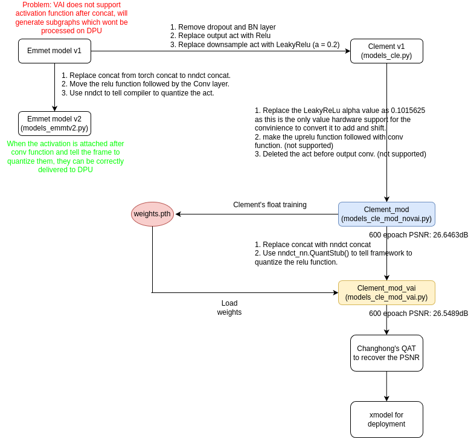

# Model for training

## Known limitation
- LeakyReLu alpha value must be 0.1015625 as this is the only value hardware support for the convinience to convert it to add and shift.
- There is a known issue that VAI can not support the combination of concat-act-conv, this will assigned to CPU processing and generate subgpraphs.
- I modified the model to meet these limitations as model: [models_cle_mod_novai.py](./models_cle_mod_novai.py) from [models_cle.py](./models_cle.py) 
- For further changes, I suggest VAI support most of ops, you can modify the model as you like but then I need a fast check.

## How to use
In this folder, you can use [train_no_vai.py](./train_no_vai.py) to call the unet model in [modified model](./models_cle_mod_novai.py).
Of course, this is just a demo
You can train it use whatever method like GAN and whatever dataset.

## Flow
- The difference of each model and workflow is shown as follows.

## Change model structure
- For this structure, I have verified with Alveo U50
- If you change the structure of the model please let me know, and the verification we can start the further training